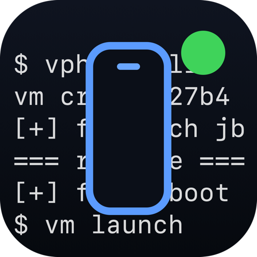
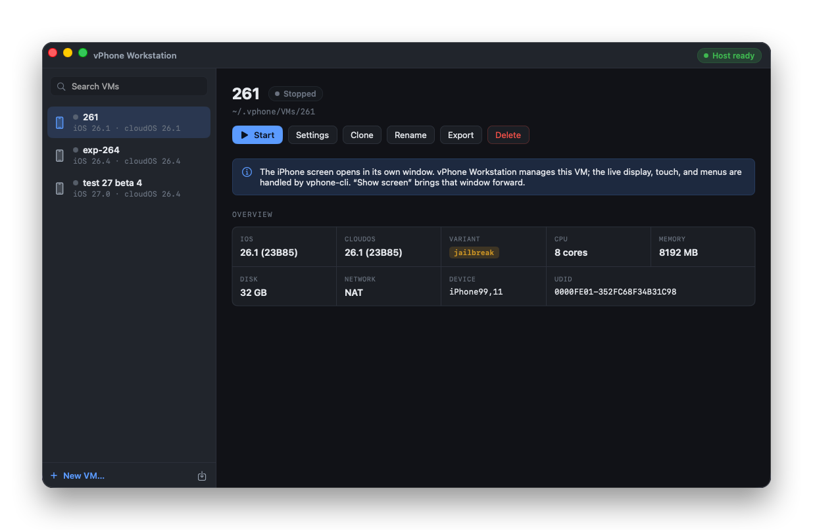
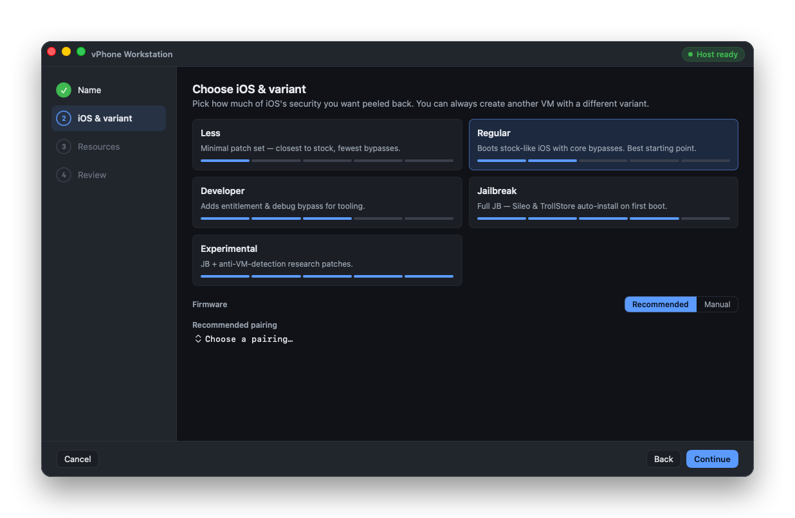

<div align="center">



# vPhone Workstation

**A native macOS app for managing virtual iPhones - browse, create, and boot iOS research VMs from a single window.**



</div>

---

vPhone Workstation is a SwiftUI front-end for **[vphone-cli](https://github.com/Lakr233/vphone-cli)** - the command-line tool that boots virtual iPhones on Apple's Virtualization.framework using PCC research VMs.

## Screenshots

**Create wizard** - pick how much of iOS's security to peel back, then a recommended firmware pairing.



## Features

- **Library** - every VM with live running/stopped state, iOS + cloudOS build, and search.
- **Detail overview** - iOS/cloudOS build, variant, CPU, memory, disk, network, device, and UDID at a glance.
- **Lifecycle** - start, stop, and bring the running iPhone window to the front.
- **Manage** - clone, rename, export (`.tar.xz`), and delete, plus per-VM settings.
- **Create wizard** - name → variant (Less · Regular · Developer · Jailbreak · Experimental) → firmware pairing → resources (CPU, memory, disk), with **live step-by-step progress** streamed from `vphone-cli` and an exportable log for issue reports.
- **Host readiness** - checks that `vphone-cli` is found, macOS is new enough, the host isn't itself a VM, research guests are allowed (`csrutil allow-research-guests`), and AMFI is bypassed (the `amfi_get_out_of_my_way` boot-arg **or** the `amfidont` daemon) - each with a clear, actionable message when it isn't.

## Requirements

- Apple Silicon Mac.
- macOS 15 (Sequoia) or newer
- **`vphone-cli`** (https://github.com/Lakr233/vphone-cli)

    ```sh
    brew install zqxwce/tap/vphone-cli
    ```

## Install

```sh
brew install zqxwce/tap/vphone-ws
```

## Build

```sh
./scripts/bundle.sh          # swift build -c release + bundle .build/vphone-ws.app
open .build/vphone-ws.app
```
